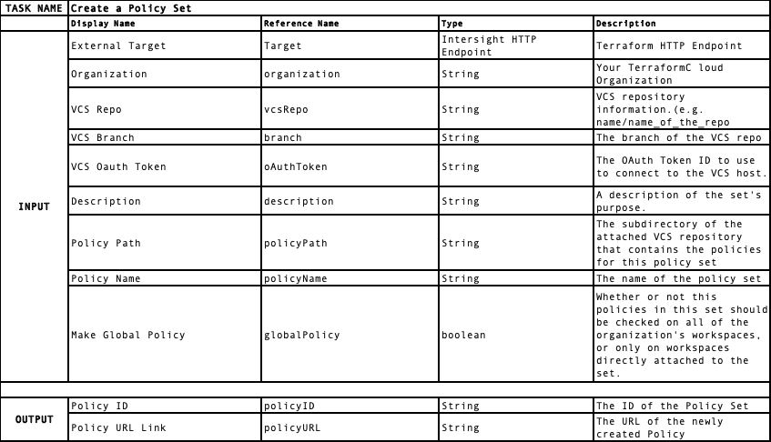
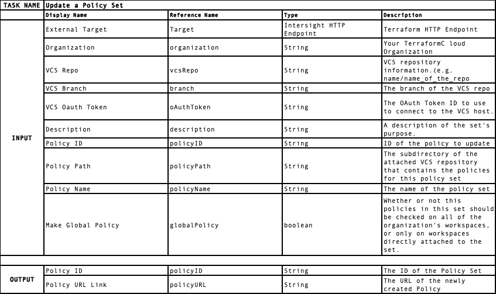
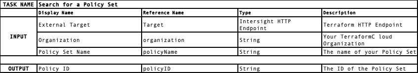
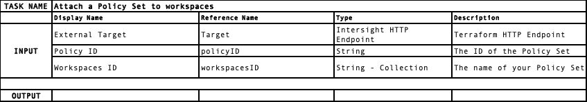
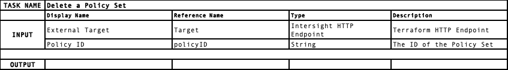
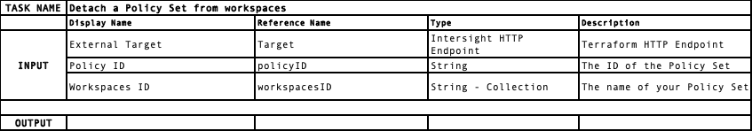
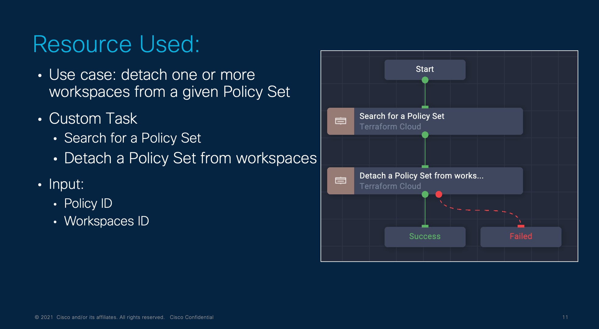

# Repository for March ICO Contest

Have you ever heard about Policy as  Code? I'm sure you have.
Policy as Code lets you treat a policy like an application, leveraging version control, pull review, and automating tests.

Intersight integrates today with HashiCorp Terraform but lacks the integration with the robust Policy as Code solution offered by HashiCorp with Sentinel.
Sentinel is an embedded policy-as-code framework integrated with the HashiCorp Enterprise products such as Terraform Cloud or Terraform Enterpise. It enables fine-grained, logic-based policy decisions and can be extended to use information from external sources.

But what can you do with Sentinel? You can write a policy that prevents the destruction of your resources in your production environment. Or allowing only some particular provider to use by your plan. Or limit the type of EC2 instances you can create. Or ... okay, okay, you got it.

> **Note:**  The repo focus is on the support of Policy Set, as the usage of a single Policy is deprecated in Terraform Cloud. Policy sets are groups of policies that are applied together to related workspaces. Notice also Sentinel policies are a paid feature available as part of the Team & Governance upgrade package from HashiCorp.

Current use cases are highlighted below. These use cases can be implemented as ICO Workflow and rely on custom tasks:
 - Create a Policy Set and attach it to a workspace(s)
 - Update a given Policy Set
 - Detach a workspace(s) from a Policy Set

The above workflow relies on the below custom task:
 - Create a Policy Set
 - Delete a Policy Set
 - Update a Policy Set
 - Attach a Policy Set to a workspaces
 - Detach a Policy Set from a workspaces
 - Search for a Policy Set

## Custom resources created in Intersight
The following entity will be created in Intersight after importing the workflow/task:
 - Custom Task:
   - Detach a Policy Set from workspaces
   - Create a Policy Set
   - Delete a Policy Set
   - Attach a Policy Set to workspaces
   - Update a Policy Set
- Custom Workflow:
  - Demo - Create a Policy Set and add a workspace

Remember, it is your responsibility to claim Terraform Cloud system as a new HTTP Endpoint target in Intersight. Don't know how to? check the Intersight manual [here](https://intersight.com/help/saas/getting_started/claim_targets).

## Custom Task Technical Details

Find below additional information on the custom task available in this repository.,

###  Create a Policy Set
Create a new Policy Set in Terraform CLoud

###  Update a Policy Set
Update an exhisting a new Policy Set in Terraform CLoud

###  Search for a Policy Set
Search for a Policy Set by name and return his Policy ID

###  Attach a Policy Set to workspaces
Attach a Policy Set to a given workspacve(s)

### Delete a Policy Set
Delete a Policy Set

###  Detach a Policy Set to workspaces
Detach a Policy Set to a given workspacve(s)

## Sample Workflow: Create a Policy Set and add one of more workspace!

The below workflow simply create a new Policy Set in your Terraform Cloud organization, and then attach one or more workspace to it. The workflow has been built relying on the above custom task. The workflow make use of one custom task:
 - Create a Policy Set
 - Attach a Policy Set to workspace(s)

It will generate the following output:
 - Policy ID (assigned by Terraform Cloud)
 - Policy URL Link (URL of the policy itself)

Youtube video link: https://youtu.be/ejVHIdGVS-8

## Sample Workflow: Demo - Detach a workspace from a Policy Set!

The below workflow simply search for the ID of a Policy Set by the name, then remove the Policy Set from one of more workspaces.T The workflow make use of one custom task:
 - Create a Policy Set
 - Attach a Policy Set to workspace(s)

It will requires following input:
 - The name of the Policy Set you're searching
 - The workspace IDs you want to remove

Youtube video link: https://youtu.be/2Zr56MFb0RQ

